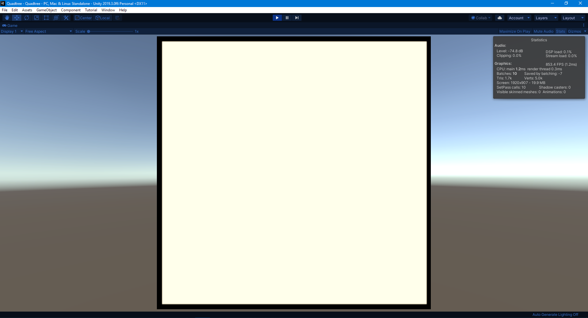
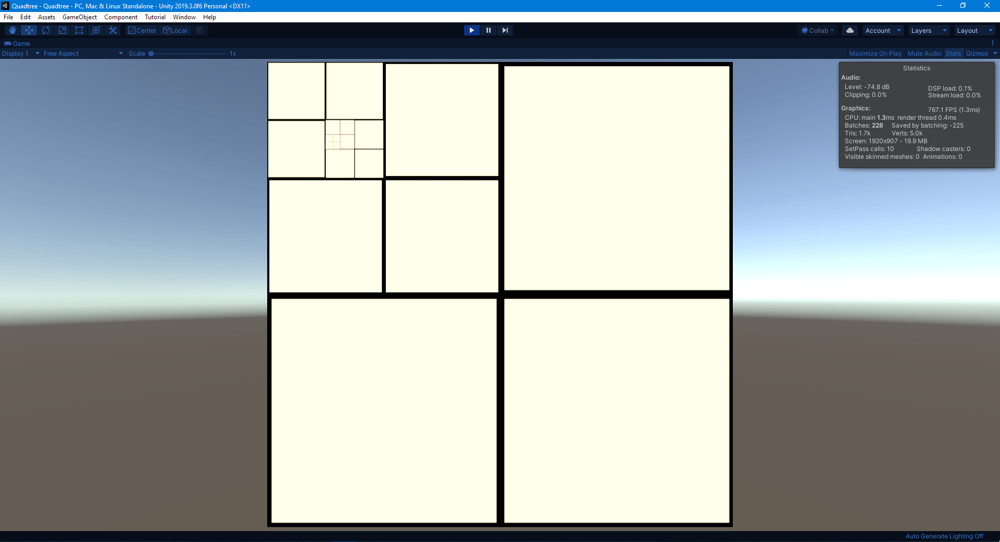

# Quadtree implementation in Unity 2019.3
There's still a few quirks to work out but it works fine as a demonstration. Used https://en.wikipedia.org/wiki/Quadtree for reference.  
**Git lfs must be installed before cloning in order to download all the assets.** It can be [downloaded here.](https://git-lfs.github.com/)
## How to:
1. Open the Quadtree.scene
2. Press play and use left click to place a point in the Quadtree. The nodes will subdivide when it has 4 points inside and you try to place a 5th.  
3. Press right click to display the current points on the Quadtree.  
The root object is the root of the Quadtree. It uses a prefab to instantiate child cubes. For now whenever a subdivision occurs the parent is set as inactive and 4 child cubes are instantiated.

### Before subdivision 

### After subdivision  

